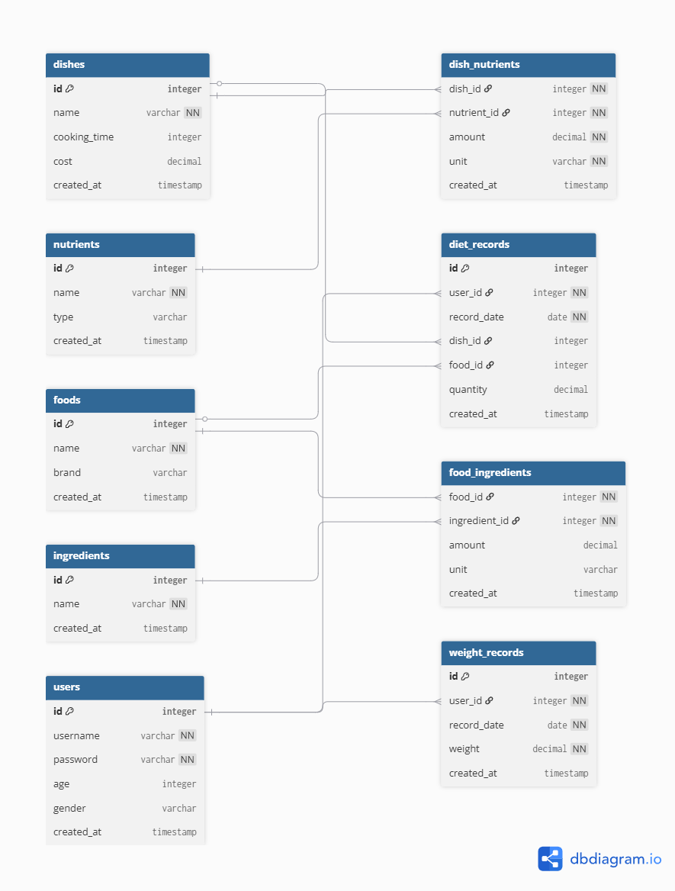

# Entity Relationship Diagram

Reference the Creating an Entity Relationship Diagram final project guide in the course portal for more information about how to complete this deliverable.

Table users {
  id integer [primary key]
  username varchar [not null]
  password varchar [not null]
  age integer
  gender varchar
  created_at timestamp
}

Table dishes {
  id integer [primary key]
  name varchar [not null]
  cooking_time integer [note: 'in minutes']
  cost decimal
  created_at timestamp
}

Table nutrients {
  id integer [primary key]
  name varchar [not null]
  type varchar
  created_at timestamp
}

Table dish_nutrients {
  dish_id integer [not null]  （foreign）
  nutrient_id integer [not null]
  amount decimal [not null]
  unit varchar [not null]
  created_at timestamp
}

Table foods {
  id integer [primary key]
  name varchar [not null]
  brand varchar
  created_at timestamp
}

Table ingredients {
  id integer [primary key]
  name varchar [not null]
  created_at timestamp
}

Table food_ingredients {
  food_id integer [not null]
  ingredient_id integer [not null]
  amount decimal
  unit varchar
  created_at timestamp
}

Table diet_records {
  id integer [primary key]
  user_id integer [not null]
  record_date date [not null]
  dish_id integer
  food_id integer
  quantity decimal
  created_at timestamp
}

Table weight_records {
  id integer [primary key]
  user_id integer [not null]
  record_date date [not null]
  weight decimal [not null]
  created_at timestamp
}

Ref user_diet: diet_records.user_id > users.id

Ref user_weight: weight_records.user_id > users.id

Ref dish_nutrients_dish: dish_nutrients.dish_id > dishes.id

Ref dish_nutrients_nutrient: dish_nutrients.nutrient_id > nutrients.id

Ref food_ingredients_food: food_ingredients.food_id > foods.id

Ref food_ingredients_ingredient: food_ingredients.ingredient_id > ingredients.id

Ref diet_dish: diet_records.dish_id > dishes.id

Ref diet_food: diet_records.food_id > foods.id
## Entity Relationship Diagram

